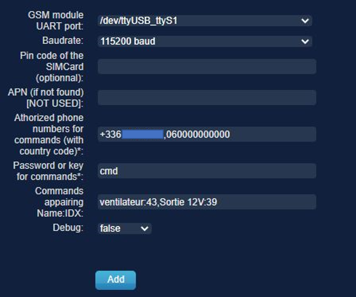

# Gammu2DomoticzBridge
A Domoticz plugin to work with Gammu and Sim808

### Goal : 
- Configure Gammu with specific port, SIM, etc... 
- Check network connectivity, received SMS
- Command the Home Automation server 
- [LATER] Bridge to RaspiSMS

### Concept : 
- Reconfigure the Gammu config file /home/pi/.gammurc with (Baudrate, Default number)
- Declare authorized phone numbers for SMS Control
- Makes use of a send_sms.sh, and call.sh scripts to prevent gammu process collision 
- The heartbeat will check received SMS and Network connectivity (may be conflicting with RaspiSMS for SMS webhooks)
- Notification based on priority. Prioriy High will be sent by SMS to the 1st user in list. Priority Emergency will be sent to everyone. 

# Installation 

### Requirements : 
- Gammu must be installed and the config file created with the right permission for modifications
- GSM module must be wired to an UART 
- Python 3.5+ with packages : psutil, shutil, pyserial, re, unidecode, requests
ll SMS.sh script 

### Installation 

See [Using_Python_plugins](https://www.domoticz.com/wiki/Using_Python_plugins)

1. Clone this repository into domoticz/plugins

> cd domoticz/plugins
>
> git clone https://github.com/Di-Ny/Gammu2DomoticzBridge

2. Restart Domoticz 
3. Domoticz > Settings : "Accept new Hardware Devices" (it will create 4 new devices)
4. Domoticz > Hardware > Find in the list "GammuDz". 
5. Fill in the parameters
6. Click "Add"

The created devices: 

### TODO :
- Use the Domoticz Transport Object instead of pyserial 
- Install Gammu and the required libraries of not already installed 
- Auto insta